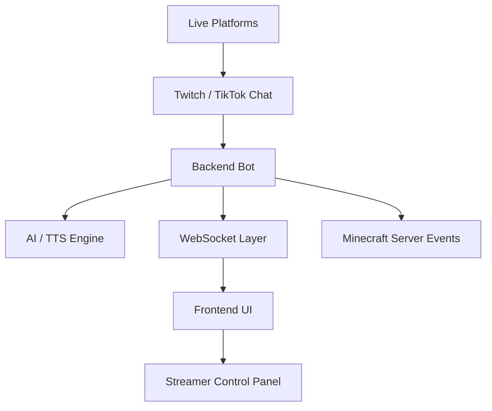

<p align="center">
  
</p>

<h1 align="center">Hi, I'm Elcreado 👋</h1>
<h3 align="center">Systems Engineer building AI assistants, TTS tools, and interactive streaming experiences.</h3>

<p align="center">
  <a href="https://github.com/elcreado">
    
  </a>
  <a href="https://x.com/Elcreado_GG">
    
  </a>
  <a href="https://www.youtube.com/@Elcreado_GG">
    
  </a>
  <a href="https://www.instagram.com/Elcreado_Alt">
    
  </a>
</p>

---

## 🚀 About Me

I am a **Systems Engineer** focused on building practical software for creators, streamers, and real-time communities.  
My projects combine **AI assistants**, **text-to-speech systems**, **chat automation**, **live event triggers**, and **interactive game integrations**.

I enjoy creating tools that make livestreams more dynamic, automated, and entertaining — especially for small and growing streamers who need powerful but accessible technology.

---

## 🧠 What I Build

- 🤖 **AI-powered virtual assistants** for streamers.
- 🔊 **TTS web systems** that read live chat interactions.
- ⚡ **Real-time chat automation** using WebSockets.
- 🎮 **Minecraft event integrations** triggered by likes, comments, donations, or rewards.
- 🛠️ **Monorepo architectures** with separated frontend, backend, and shared packages.
- 🎙️ **Voice-command moderation** and live interaction tools.
- 📡 Integrations with platforms like **Twitch** and **TikTok Live**.

---

## 🧰 Tech Stack

<p align="center">
  
  
  
  
  
  
  
  
  
</p>

<p align="center">
  
  
  
  
  
</p>

---

## 📌 Featured Projects

### 🤖 Sara IA Assistant

**Sara IA Assistant** is an AI-powered virtual assistant designed to improve the experience of small streamers.

It can interact with chat messages, select random messages, respond through automation, and support moderation features through voice commands.

**Main skills shown:**

- JavaScript development.
- AI assistant logic.
- Chat interaction systems.
- Channel-points-based interactions.
- Voice-command moderation.
- Twitch-focused streamer tooling.

**Language profile:**

```txt
JavaScript 100%
```

---

### 🔊 TTS Web Monorepo

**TTS Web Monorepo** is a real-time web system designed to read TikTok chat interactions through a web-based text-to-speech workflow.

The project is organized into frontend, backend, and shared packages, making it scalable and easier to maintain.

**Important dependencies and tools:**

- `pnpm` as package manager.
- `tiktok-live-connector` for TikTok Live chat connection.
- `ws` for frontend-backend WebSocket communication.
- `vite` for fast web development.
- Monorepo structure with shared packages.

**Project structure:**

```txt
apps/web          -> Web application
apps/backend      -> TikTok bot backend
packages/shared   -> Shared library
```

**Language profile:**

```txt
TypeScript 83.5%
CSS        14.8%
JavaScript  1.2%
HTML        0.5%
```

---

### 🎮 StreamCraft Rewards

**StreamCraft Rewards** is an interactive streaming application that connects livestream platforms with Minecraft events.

It allows streamers to generate in-game events based on audience actions such as likes, comments, donations, or channel rewards.

**Main skills shown:**

- JavaScript application development.
- Electron desktop app workflow.
- Twitch and TikTok integration.
- Minecraft server event automation.
- Live reward systems.
- Streamer-focused user experience.

**Language profile:**

```txt
JavaScript 74.6%
HTML       12.8%
CSS        12.6%
```

---

## 🏗️ Architecture & Engineering Skills



I work with systems that require real-time data flow, event-driven logic, and clear separation between frontend, backend, and shared modules.

---

## 🌟 Core Strengths

| Area | Skills |
|---|---|
| Backend | Node.js, WebSockets, bot logic, event handling |
| Frontend | Vite, TypeScript, HTML, CSS, interactive interfaces |
| Desktop Apps | Electron-based streamer tools |
| Streaming Tech | Twitch, TikTok Live, channel rewards, chat automation |
| AI Tools | AI assistants, message selection, automated responses |
| Audio | Web TTS, voice commands, moderation workflows |
| Game Integration | Minecraft event triggers and reward systems |
| Architecture | Monorepos, shared packages, modular project structure |

---

## 📊 GitHub Stats

<p align="center">
  
  
</p>

---

## 🎯 Current Focus

- Improving AI interaction for streamers.
- Building stable TTS workflows for live chat.
- Expanding Twitch and TikTok automation.
- Creating more interactive Minecraft livestream experiences.
- Designing tools that are simple enough for small creators but powerful enough for advanced live production.

---

## 📫 Contact

<p align="center">
  <a href="https://github.com/elcreado">
    
  </a>
  <a href="https://x.com/Elcreado_GG">
    
  </a>
  <a href="https://www.youtube.com/@Elcreado_GG">
    
  </a>
  <a href="https://www.instagram.com/Elcreado_Alt">
    
  </a>
</p>

---

<p align="center">
  <b>Building real-time tools for creators, streamers, and interactive communities.</b>
</p>

<p align="center">
  
</p>
